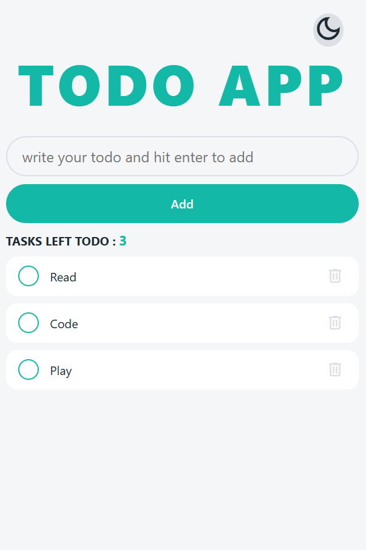
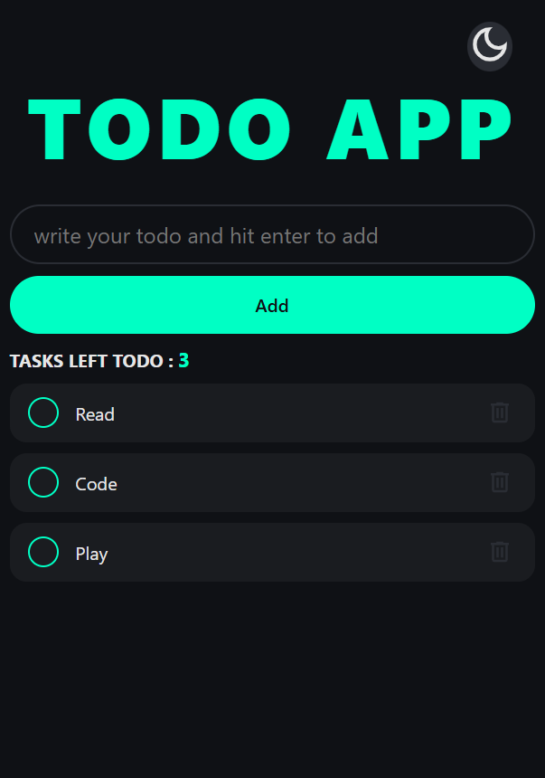

# ✅ Todo App

A simple and interactive task management application built with vanilla JavaScript.
This project demonstrates dynamic UI updates, state management, and user interaction handling.

---

## Live Demo

👉 https://oussama-dalhi.github.io/todo-app/

---

## ✨ Features

*  Add new tasks
*  Mark tasks as completed
*  Delete tasks
*  Instant UI updates
*  Simple state management using JavaScript
*  Dark/Light Theme
*  Tasks left todo counter

---

## 🧠 What This Project Demonstrates

* DOM manipulation and event handling
* Managing application state (tasks list)
* Updating UI dynamically based on user actions
* Writing clean and structured JavaScript

---

## 🛠️ Tech Stack

* HTML5
* CSS3
* JavaScript (ES6+)

---

## 📂 Project Structure

```plaintext id="todo21x"
.
├── index.html
├── README.md
├── assets/
│   ├── check_24dp_E3E3E3_FILL0_wght400_GRAD0_opsz24.svg
│   └── delete_24dp_E3E3E3_FILL0_wght400_GRAD0_opsz24.svg
└── src/
    ├── app.js
    └── style.css
```

---

## ⚙️ Getting Started

```bash id="todo98x"
git clone https://github.com/oussama-dalhi/todo-app.git
cd todo-app
```

Open `index.html` in your browser.

---

## 📸 Screenshots



---

## 🌟 Future Improvements

* 💾 Persist tasks using localStorage
* ✏️ Edit existing tasks
* 📱 Improve mobile responsiveness
* 🎨 Add filters (All / Completed / Active)

---

## ⚠️ Disclaimer

This project is for learning purposes and demonstrates core JavaScript concepts.

---

## 🙌 Acknowledgements

Built as part of practicing JavaScript fundamentals.

---

